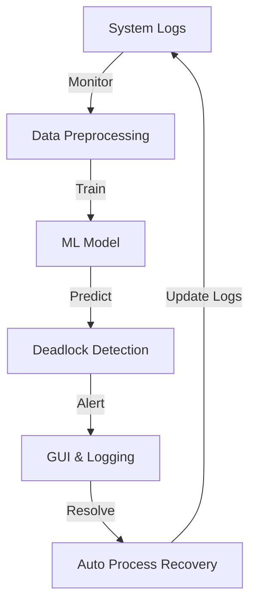

# AI-Powered Deadlock Detection System

## 📌 Project Overview
The **AI-Powered Deadlock Detection System** is an advanced tool designed to predict, detect, and resolve deadlocks in real-time using artificial intelligence and automation techniques. Deadlocks occur when multiple processes wait for resources in a circular chain, leading to system stalls. This system aims to:

- **Predict Deadlocks:** Identify patterns leading to deadlocks before they occur.
- **Detect Deadlocks:** Recognize deadlocks in real-time through process monitoring and log analysis.
- **Resolve Deadlocks:** Implement automated strategies to break deadlocks and maintain smooth system operations.

This project leverages **Python, Bash, AI-based models, and system monitoring techniques** to enhance deadlock management, ensuring system stability and efficiency.

---

## 💁️️ Team Members
- **Abhishek Mohan**  
- **Deepanshu**  
- **Contributors Welcome!**

---

## 📁 Project Structure

The repository follows a well-structured modular approach:

```
AI-Deadlock-Detection/
👈 ai_model/           # Contains ML training scripts (Google Colab & Local Training)
👈 gui/                # GUI implementation for monitoring
👈 data/               # Sample datasets for ML training & deadlock logs
👈 logs/               # Stores logs of detected deadlocks
👈 recovery/           # Auto Process Recovery System scripts
👈 monitoring/         # OS Process Monitoring Integration scripts
👈 requirements.txt    # List of dependencies
👈 main.py             # Main script for system execution
👈 README.md           # Project Documentation
```

Each module plays a crucial role in making the system scalable, efficient, and effective.

---

## 🛠️ Module-Wise Breakdown

### 1️⃣ **AI Model for Deadlock Prediction & Detection**
This module utilizes machine learning to predict and detect deadlocks.
- **Key Features:**
  - Collects and processes system logs
  - Trains a deep learning model to identify deadlock-prone scenarios
  - Uses real-time monitoring to detect active deadlocks
- **Technologies Used:** Python, Pandas, Scikit-learn, TensorFlow, Google Colab
- **Model Architecture:** Uses a **Long Short-Term Memory (LSTM)** network to analyze historical system logs and detect anomalies leading to deadlocks.

### 2️⃣ **Graphical User Interface (GUI) for Monitoring**
A user-friendly interface for real-time deadlock tracking and resolution.
- **Key Features:**
  - Displays system status in real-time
  - Alerts users about detected deadlocks
  - Allows manual and automated deadlock resolution
- **Technologies Used:** Tkinter/PyQt, Matplotlib, Seaborn
- **GUI Components:**
  - **Live Process Dashboard:** Displays all active processes
  - **Deadlock Alert Box:** Pop-up notifications for detected deadlocks
  - **Manual Recovery Options:** Buttons for user intervention

### 3️⃣ **Logging & Data Handling**
Maintains records of deadlocks and supports AI training data.
- **Key Features:**
  - Logs system interactions and deadlock occurrences
  - Stores datasets used for ML training
  - Generates analytical reports on system health
- **Technologies Used:** CSV, JSON, Pandas, Logging module

### 4️⃣ **OS Process Monitoring Integration**
Enhances system-level monitoring for better deadlock detection.
- **Key Features:**
  - Tracks system processes and resource allocation
  - Detects resource starvation issues leading to deadlocks
- **Technologies Used:** psutil, Bash, Python
- **Process Monitoring Flow:**
  1. Uses `psutil` to fetch real-time process and resource allocation data.
  2. Analyzes CPU, memory, and I/O usage patterns.
  3. Reports anomalies to the AI model for further evaluation.

### 5️⃣ **Log Analysis & Auto-Debugging**
Automates deadlock debugging using AI-based log analysis.
- **Key Features:**
  - Analyzes logs to identify recurring deadlock patterns
  - Provides debugging suggestions to users
- **Technologies Used:** Natural Language Processing (NLP), Python
- **Log Analysis Pipeline:**
  - **Data Collection → Log Parsing → Anomaly Detection → Debugging Suggestions**

### 6️⃣ **Auto Process Recovery System**
Automatically recovers processes from deadlocks without manual intervention.
- **Key Features:**
  - Identifies and restarts deadlocked processes
  - Ensures minimum disruption to system operations
- **Technologies Used:** Bash Scripting, Python Process Management
- **Deadlock Resolution Strategies:**
  - **Process Termination:** Kills the least critical process to free resources.
  - **Resource Preemption:** Forces resource reallocation based on priority.

---

## 📊 System Flow Diagram



---

## 🚀 Technology Stack

### **Programming Languages:**
- **Python**: Core language for AI and system monitoring.
- **Bash**: Used for system process management.

### **Libraries and Tools:**
- **Scikit-learn & TensorFlow** (AI & ML Model Training)
- **Pandas & NumPy** (Data Handling)
- **Matplotlib & Seaborn** (Data Visualization)
- **Tkinter/PyQt** (GUI for real-time monitoring)
- **Logging module** (System log tracking)
- **Google Colab** (Cloud-based AI training)
- **psutil** (Process monitoring)

---

## 🛠️ Execution Plan

### Step 1: Setting Up the Environment
1. Clone the repository:
   ```bash
   git clone https://github.com/abhi-mohan/AI-POWERED-DEADLOCK-DETECTION.git
   cd AI-Deadlock-Detection
   ```
2. Install dependencies:
   ```bash
   pip install -r requirements.txt
   ```

### Step 2: Generating Data for AI Model Training
Run the script to create sample deadlock scenarios:
```bash
python data/generate_deadlock_data.py
```

### Step 3: Training the AI Model
Execute the AI training script in Google Colab:
```python
python ai_model/train_model.py
```

### Step 4: Running the Deadlock Detection System
Start the main script to detect and resolve deadlocks in real-time:
```bash
python main.py
```

### Step 5: Viewing Logs & Results
Access deadlock logs stored in the `logs/` folder:
```bash
cat logs/deadlock_logs.txt
```

---

## 🔮 Conclusion & Future Scope
This AI-powered deadlock detection system enhances operating system efficiency by proactively handling deadlocks. 

### **Future Enhancements:**
- Implement reinforcement learning for adaptive deadlock resolution.
- Integrate deep learning models for faster, more accurate detection.
- Improve system-wide monitoring with advanced visualization tools.

---

🚀 **Happy Coding!**
