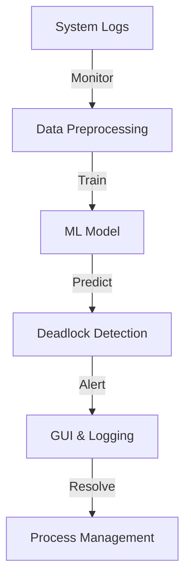

# AI-POWERED-DEADLOCK-DETECTION
# AI-Powered Deadlock Detection System

## 📌 Project Overview
The **AI-Powered Deadlock Detection System** is designed to predict, detect, and resolve deadlocks in real-time using machine learning and automation techniques. Deadlocks occur when multiple processes wait for resources in a circular chain, preventing further execution. Our system aims to:

- **Predict Deadlocks**: Identify patterns leading to deadlocks before they occur.
- **Detect Deadlocks**: Recognize deadlocks in real-time using process monitoring.
- **Resolve Deadlocks**: Implement automated strategies to break deadlocks and maintain smooth system operations.

This project leverages **Python, Bash, and Google Colab** for implementation, focusing on AI-driven detection mechanisms.

---

## 📁 Project Structure

The repository is organized as follows:

```
AI-Deadlock-Detection/
│── ai_model/           # Contains ML training scripts (Google Colab)
│── gui/                # Contains GUI implementation
│── data/               # Sample datasets for ML training
│── logs/               # Stores logs of detected deadlocks
│── requirements.txt    # List of dependencies
│── main.py             # Main script for running the system
└── README.md           # Project Documentation
```

Each folder serves a specific role, ensuring a modular and scalable design.

---

## 🛠️ Module-Wise Breakdown

The project is divided into three core modules:

### 1️⃣ **AI Model (Deadlock Prediction & Detection)**
This module focuses on building an ML model to predict and detect deadlocks.
- **Key Features:**
  - Collects and processes system logs
  - Trains a machine learning model to identify deadlock-prone scenarios
  - Uses historical data to enhance predictions
- **Technologies Used:** Python, Pandas, Scikit-learn, TensorFlow, Google Colab

### 2️⃣ **Graphical User Interface (GUI)**
Provides a user-friendly interface for interacting with the system.
- **Key Features:**
  - Displays real-time system status
  - Alerts users about detected deadlocks
  - Allows manual and automated deadlock resolution
- **Technologies Used:** Tkinter/PyQt, Matplotlib (for visualization)

### 3️⃣ **Logging & Data Handling**
Maintains records of deadlocks and model training data.
- **Key Features:**
  - Logs process interactions and deadlock occurrences
  - Stores datasets used for ML training
  - Generates reports on system health and deadlock trends
- **Technologies Used:** CSV, JSON, Pandas, Logging module

---

## 🔑 Functionalities

The system provides:

✅ **Real-Time Deadlock Detection**: Identifies active deadlocks in system logs.
✅ **AI-Based Prediction**: Uses ML models to predict potential deadlocks.
✅ **Visualization & Reports**: Displays graphical insights into system resource usage.
✅ **Automated Resolution Strategies**: Implements solutions like process termination or priority adjustments.
✅ **Logging & Analysis**: Records detected deadlocks for future reference and analysis.

---

## 🚀 Technology Stack

### **Programming Languages:**
- **Python**: Core language for AI and system monitoring.
- **Bash**: Used for process-level deadlock simulation.

### **Libraries and Tools:**
- **Scikit-learn** (ML Model Training)
- **TensorFlow/PyTorch** (Deep Learning models, if required)
- **Pandas & NumPy** (Data Handling)
- **Matplotlib & Seaborn** (Data Visualization)
- **Tkinter/PyQt** (GUI for real-time status tracking)
- **Logging module** (Error handling and deadlock tracking)
- **Google Colab** (For cloud-based ML training)

---

## 🔄 Execution Plan

### Step 1: Setting Up the Environment
1. Clone the repository:
   ```bash
   git clone https://github.com/yourusername/AI-Deadlock-Detection.git
   cd AI-Deadlock-Detection
   ```
2. Install dependencies:
   ```bash
   pip install -r requirements.txt
   ```

### Step 2: Generating Data for Training
Run the dataset generation script to create sample deadlock scenarios:
```bash
python data/generate_deadlock_data.py
```

### Step 3: Training the AI Model
Execute the training script in Google Colab:
```python
python ai_model/train_model.py
```

### Step 4: Running the Deadlock Detection System
Start the main script to detect deadlocks in real-time:
```bash
python main.py
```

### Step 5: Viewing Logs & Results
Logs will be stored in the `logs/` folder and can be viewed using:
```bash
cat logs/deadlock_logs.txt
```

---

## 📊 Flow Diagram



---

## 🔄 Revision Tracking on GitHub

- **Repository Name:** AI-Deadlock-Detection
- **GitHub Link:** [https://github.com/abhi-mohan/AI-POWERED-DEADLOCK-DETECTION]

### **Commit Guidelines:**
✅ Use descriptive commit messages, e.g.,
```bash
git commit -m "Added deadlock dataset generation script"
```
✅ Use **feature branches** for development and merge into `main` after testing.

---

## 🔮 Conclusion & Future Scope
This project demonstrates an AI-driven approach to managing deadlocks, improving system efficiency. 

### **Future Enhancements:**
- Implementing reinforcement learning for better decision-making.
- Expanding dataset with real-world deadlock scenarios.
- Optimizing detection speed with faster ML algorithms.

---

## 📚 References
1. **Operating System Concepts** by Silberschatz et al.
2. Research papers on AI-driven deadlock prevention.
3. Python documentation for libraries used in this project.

---

## 📌 Appendix
### **A. AI-Generated Project Breakdown Report**
_(To be updated)_

### **B. Problem Statement**
AI-Powered Deadlock Detection System: Design an AI-driven system to predict, detect, and resolve deadlocks in real-time.

### **C. Solution/Code**
_(Complete project code will be maintained in this repository soon )_

---

💡 **Maintainer:** _Abhishek Mohan_
💡 **Co - Worker:** _Deepanshu_
📅 **Last Updated:** _March 2025_

🚀 **Happy Coding!**

